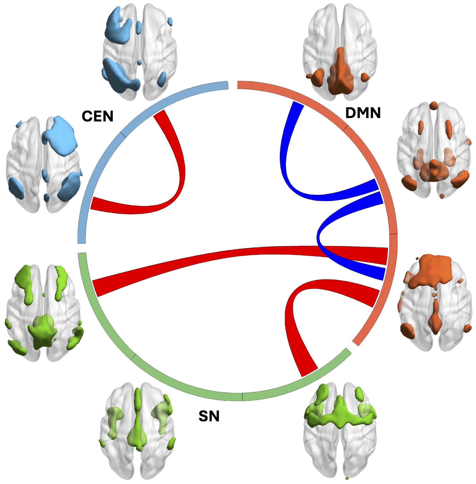

# Wang Lab

Dr. Wang's laboratory focuses on the intersection of machine learning and medical imaging. The lab develops and applies methods in machine learning, artificial intelligence, and data science to process and analyze medical images to understand the mechanisms of diseases and build diagnostic/predictive models.

## Highlights
<!-- Bootstrap 5 Image Slider -->

  <!-- Indicators -->
  

    <button type="button" data-bs-target="#imageCarousel" data-bs-slide-to="0" class="active" aria-current="true" aria-label="Slide 1"></button>
    <button type="button" data-bs-target="#imageCarousel" data-bs-slide-to="1" aria-label="Slide 2"></button>
    <button type="button" data-bs-target="#imageCarousel" data-bs-slide-to="2" aria-label="Slide 3"></button>
  

  

    

      

        <h5>Description for Image 1</h5>
      

      
    

    

      

        <h5>Description for Image 2</h5>
      

      
    

    

      

        <h5>Description for Image 3</h5>
      

      
    

  

  <!-- Controls -->
  <button class="carousel-control-prev" type="button" data-bs-target="#imageCarousel" data-bs-slide="prev">
    
    Previous
  </button>
  <button class="carousel-control-next" type="button" data-bs-target="#imageCarousel" data-bs-slide="next">
    
    Next
  </button>


## Latest News



  <ul class="news-list">
    
      <li>
        {{ news.date | date: "%d %b, %Y" }}: {{ news.title }}
      </li>
    
  </ul>

  

    <a href="{{ '/news/' | relative_url }}" class="button">Load More</a>
  

